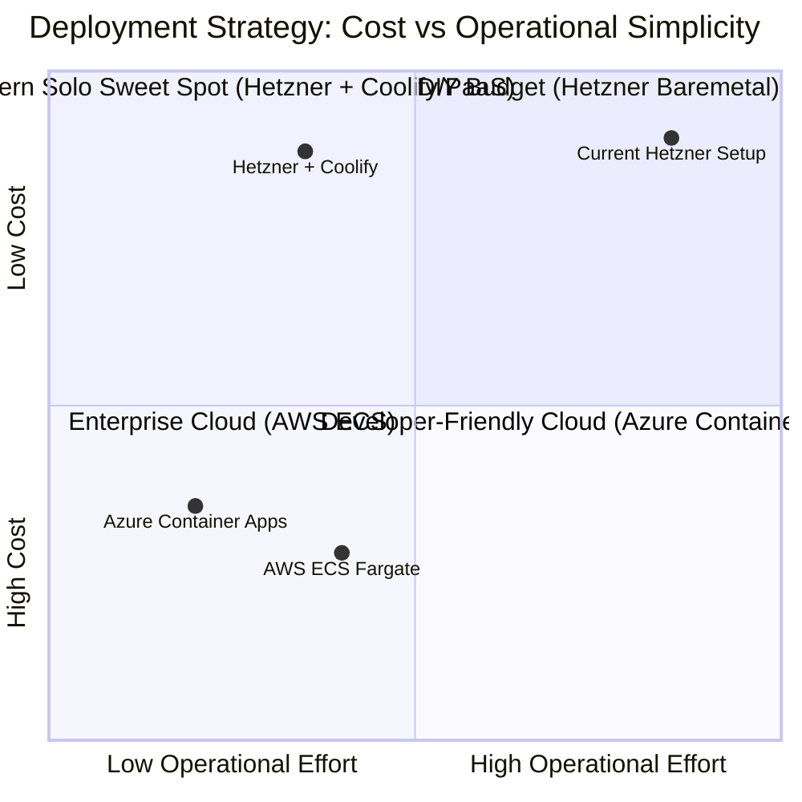

# Deployment & Cloud Migration Strategy Comparison

**Target Project:** GrainTrade Info  
**Evaluated Platforms:** Hetzner Dedicated / Cloud vs. Microsoft Azure vs. Amazon Web Services (AWS)  
**Profile:** Solo Owner & Developer  
**Key Constraints:** Limited time for DevOps maintenance, need for mobile-first monitoring and incident management, cost-effectiveness.

---

## 1. Executive Summary & Quick Recommendation

As a **solo owner and developer**, the most critical constraint is **engineering time and operational cognitive load**, not solely infrastructure costs.

| Metric / Dimension | Hetzner AX41 Dedicated (Current Raw Docker) | Hetzner AX41 + PaaS (e.g. Coolify) | Microsoft Azure (Container Apps + Managed Postgres) | AWS (ECS Fargate + RDS + ALB) |
|---|---|---|---|---|
| **Estimated Monthly Cost** | **€59 – €65** (incl. backup) | **€59 – €65** | **$120 – $220** | **$150 – $280** |
| **DevOps Maintenance** | **High** (Manual OS, backups, proxy, SSL, patching) | **Low – Medium** (Automated deploys, SSL, backups) | **Very Low** (Serverless containers, managed DB) | **Low – Medium** (Complex IAM/VPC overhead) |
| **Learning Curve** | Low (Standard Linux / Docker) | Low | **Moderate** (Clean resource abstractions) | **High** (Steep IAM, networking & policies) |
| **Mobile App Control** | Low (SSH / Termius terminal) | Medium (Web UI + Telegram/Discord bots) | **High** (Native 1-tap restarts, metrics, alerts) | Medium (AWS Console Mobile App) |
| **Solo Dev Verdict** | ⚠️ High burnout / maintenance risk | 🌟 **Best Low-Cost Alternative** | 🌟 **Best Overall Cloud & Mobile Experience** | ⚠️ Over-engineered for a solo developer |

---

## 2. Decision Matrix & Feature Comparison

### Detailed Feature Comparison

| Area | Current Hetzner Setup | Hetzner + Coolify / Dokku | Azure Cloud | AWS Cloud |
|---|---|---|---|---|
| **Compute Engine** | Single Baremetal / VPS | Single Host with PaaS UI | Azure Container Apps / App Service | ECS Fargate / App Runner |
| **Database Management** | Self-hosted Docker container (manual backups) | Self-hosted with automated S3 backup triggers | Azure Database for PostgreSQL Flexible (automated PITR, patches) | AWS RDS PostgreSQL (automated backups, multi-AZ) |
| **Message Broker (RabbitMQ / Redis)** | Self-hosted Docker containers | Self-hosted Docker containers | Azure Cache for Redis + Azure Service Bus or Container RabbitMQ | Amazon ElastiCache + Amazon MQ |
| **SSL & Routing** | Manual Apache2 / Certbot configuration | Traefik / Caddy (automatic Let's Encrypt) | Built-in managed TLS on Container Apps / Front Door | Application Load Balancer + AWS Certificate Manager |
| **CI/CD** | Self-hosted Jenkins / Gitea | Push to GitHub/GitLab -> Auto-deploy | GitHub Actions -> Azure Container Apps | GitHub Actions -> ECR -> ECS |
| **Observability** | Self-hosted Prometheus + Grafana | Prometheus / BetterStack | Azure Monitor & Application Insights | AWS CloudWatch & Container Insights |

---

## 3. Cost Breakdown (Monthly Estimates)

### A. Hetzner Dedicated Server (AX41)
* **Hardware (Hetzner AX41):** AMD Ryzen 5 3600 (6-core/12-thread), 64 GB DDR4 RAM, 2x 512 GB NVMe SSD: **€59.00 / month**.
* **Bandwidth:** Unlimited traffic with 1 Gbit/s port (guaranteed).
* **Backups:** Hetzner Storage Box (e.g., BX11 1TB): ~€3.80 / month.
* **Total Estimated:** **€59 – €63 / month (~$65 – $70 USD)**.

### B. Microsoft Azure
* **Azure Database for PostgreSQL Flexible Server (Burstable B1ms or B2s):** $30 – $65/month.
* **Azure Container Apps (5 Microservices with scale-to-zero / low idle):** $40 – $90/month.
* **Azure Static Web Apps (Vue Frontend):** Free Tier ($0) or Standard ($9/month).
* **Azure Cache for Redis (Basic C0):** ~$13/month.
* **Container Registry & Log Analytics:** ~$8 – $15/month.
* **Total Estimated:** **$90 – $180 / month** *(eligible for Microsoft for Startups Founders Hub credits)*.

### C. Amazon Web Services (AWS)
* **AWS RDS PostgreSQL (`db.t4g.small`):** $35 – $50/month.
* **ECS Fargate (5 services, 0.25–0.5 vCPU each):** $60 – $100/month.
* **Application Load Balancer (ALB):** $22 – $30/month.
* **NAT Gateway (standard VPC pattern):** $32/month + traffic.
* **ElastiCache Redis (`cache.t4g.micro`):** $15/month.
* **Total Estimated:** **$150 – $280 / month**.

---

## 4. Learning Curve & Operational Overhead

### 1. Current Hetzner Setup
* **Pros:** Complete control, lowest raw hardware price per GB/CPU.
* **Cons:** Single point of failure; you are responsible for OS security patches, disk space alerts, SSL renewals, database vacuuming, WAL archiving, and monitoring infrastructure uptime.

### 2. Azure (Recommended Cloud Option)
* **Pros:**
  * Cleanest abstractions for microservices via **Azure Container Apps**.
  * Native integration between GitHub Actions and Azure.
  * Point-in-time database restoration without custom shell scripts.
  * Built-in Application Insights provides instant APM without managing Prometheus/Grafana storage.
* **Cons:** Higher baseline monthly cost than Hetzner.

### 3. AWS
* **Pros:** Industry standard, comprehensive feature set.
* **Cons:**
  * Complex IAM security policies, VPC networking (subnets, route tables, internet gateways, NAT gateways).
  * High accidental cost risk (e.g., forgotten NAT gateways, unattached EBS volumes).
  * Significant cognitive load for a single developer.

---

## 5. Mobile App Control & Incident Management

| Capability | Azure Mobile App | AWS Console Mobile App | Hetzner (Termius / Web) |
|---|---|---|---|
| **Emergency Container Restart** | **1-Tap** directly on Container App | Multi-step ECS task kill/update | SSH terminal login required |
| **Real-Time Health Alerts** | Native Push notifications via Azure Monitor | CloudWatch Alarm notifications | Requires 3rd party (BetterStack/Telegram) |
| **Integrated CLI / Shell** | Built-in Azure Cloud Shell | Built-in CloudShell | External SSH client |
| **Metric Dashboards** | Interactive latency, CPU, and memory graphs | CloudWatch metric charts | Self-hosted Grafana web UI |

---

## 6. Migration Pathways & Recommendations

### Strategy Path A (Recommended): Migrate to Azure Container Apps
* **Ideal for:** Maximizing solo developer productivity, eliminating server maintenance, full mobile incident management.
* **Steps:**
  1. Create Azure Resource Group and Managed PostgreSQL Flexible Server.
  2. Deploy microservices via Azure Container Apps using existing Dockerfiles.
  3. Deploy Vue frontend to Azure Static Web Apps.
  4. Configure GitHub Actions CI/CD with Azure credentials.
  5. Install the Azure Mobile App and configure push notification alerts for health checks.
* **Reference Guides:**
  * [AZURE_MIGRATION_GUIDE.md](AZURE_MIGRATION_GUIDE.md)
  * [AZURE_QUICK_REFERENCE.md](AZURE_QUICK_REFERENCE.md)
  * [AZURE_DEPLOYMENT_GUIDE.md](AZURE_DEPLOYMENT_GUIDE.md)

### Strategy Path B (Budget-Optimized): Hetzner + Coolify PaaS
* **Ideal for:** Keeping your current fixed hosting costs (~€59/mo) while eliminating 80% of manual DevOps.
* **Steps:**
  1. Install [Coolify](https://coolify.io) on the Hetzner server.
  2. Connect your GitHub repository to Coolify for automated push-to-deploy.
  3. Let Coolify handle automatic SSL certificates via Traefik.
  4. Configure automated PostgreSQL database backups to S3 / Backblaze B2.
  5. Set up BetterStack or Telegram Webhooks for mobile downtime alerts.

### Strategy Path C: AWS Migration
* **Ideal for:** Situations where substantial AWS Activate credits ($5,000+) are available and active.
* **Reference Guide:**
  * [AWS_MIGRATION_GUIDE.md](AWS_MIGRATION_GUIDE.md)
  * [AWS_COST_OPTIMIZATION.md](AWS_COST_OPTIMIZATION.md)
